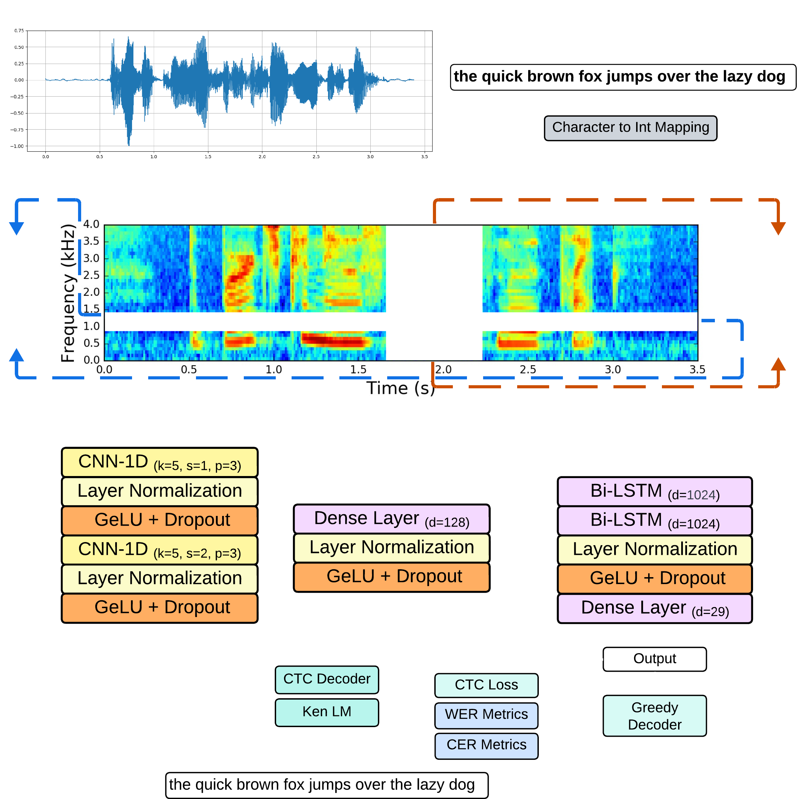

# 🚀 End-to-End Automatic Speech Recognition

<div align="center">

      

</div>



This project focuses on creating a small-scale speech recognition system for transcribing audio inputs into text. The system employs a **CNN1D + BiLSTM** based Acoustic Model, designed specifically for small-scale datasets and faster training of ASR (Automatic Speech Recognition).

## 💻 **Installation**

- Install the **CUDA version** of PyTorch for training and the **CPU version** for inference, then install the remaining dependencies:  
   ```bash
   pip install -r requirements.txt
   ```

## 🚀 **Usage**

### **1. Dataset Conversion Script**

> [!NOTE]
> - The dataset conversion script is designed to convert the [**CommonVoice**](https://commonvoice.mozilla.org/en/datasets) dataset to the format required for training the speech recognition model. 
> - Use the `--not-convert` flag to skip the conversion step and export only the dataset paths and utterances in JSON format.

```bash
py common_voice.py --file_path path/to/validated.tsv --save_json_path converted_clips --percent 20
``` 

### **2. Train the Model**

```bash
py train.py --train_json path/to/train.json --valid_json path/to/test.json \
--epochs 20 \
--batch_size 32 \
--lr 1e-4 \
--grad_clip 0.5 \
--accumulate_grad 4 \
--gpus 1 \
--w 8 \
--checkpoint_path path/to/checkpoint.ckpt
```

### **3. Export to TorchScript**

```bash
python freeze_model.py --model_checkpoint path/to/model.ckpt
```

### **4. Run Inference**

```bash
python engine.py --model_file path/to/optimized_model.pt --ken_lm_file language_model.bin
```

---

## 📄 **License**

This project is licensed under the MIT License. See the [LICENSE](LICENSE) file for details.

---

This guide should help you effectively set up and use the speech recognition system. If you encounter any issues or have questions, feel free to reach out or submit a issue in the repository.